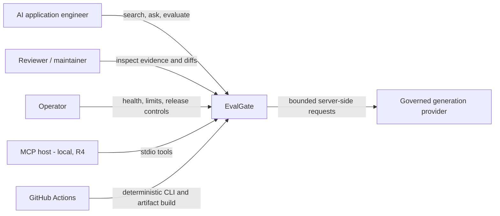
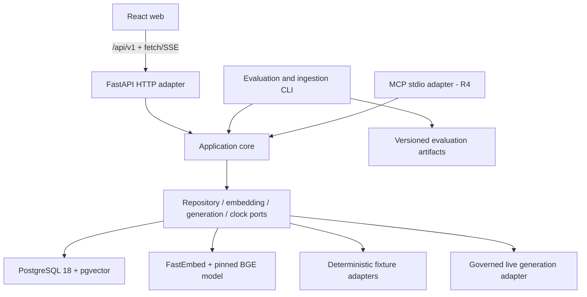
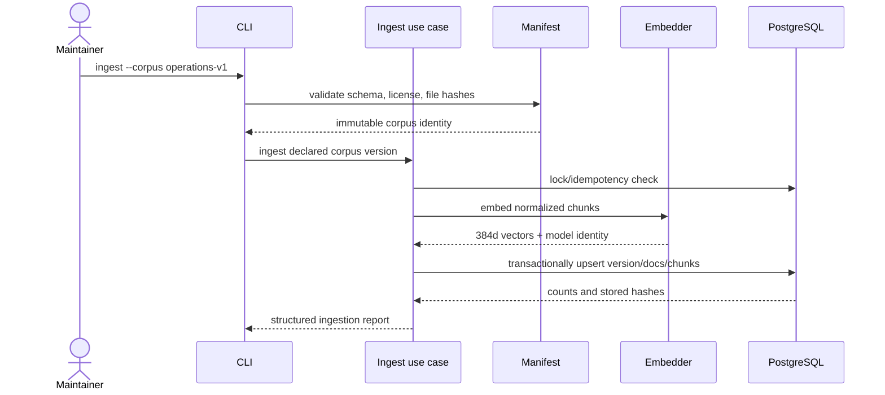
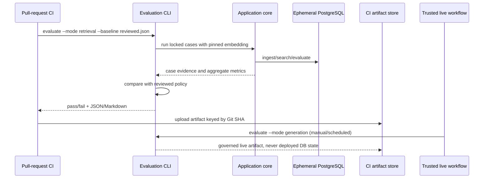
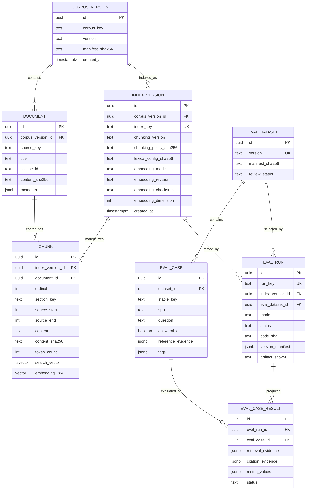
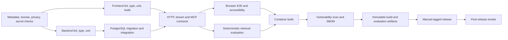

# EvalGate Production Blueprint

| Field | Value |
|---|---|
| Document | Product, architecture, delivery, and production-readiness blueprint |
| Version | 1.0 |
| Status | Approved for foundation work; external-service decisions remain gated |
| Approved | 2026-08-08 |
| Product state | Pre-production |
| Canonical location | `BLUEPRINT.md` |

This document is the engineering contract for EvalGate. It defines what the product is, the boundaries it must preserve, the evidence required before claims are made, and the order in which it will be built. Code, contracts, tests, and release artifacts must remain traceable to it. A material change to the product boundary, data model, public security posture, evaluation policy, or external-provider policy requires an architecture decision record (ADR) and an update to this document.

## 1. Executive decision

EvalGate helps AI application teams detect retrieval, grounding, and citation regressions before release.

The product is a small, reproducible change-control workbench for a retrieval-augmented generation (RAG) system. A user can ingest a governed corpus, inspect hybrid retrieval, stream a cited answer, run a versioned evaluation set, and compare the result with a reviewed baseline. The same application core can later be exposed through a separate local MCP process.

The first credible release is intentionally narrow:

- one original synthetic technical-operations corpus;
- one pinned local embedding model;
- PostgreSQL full-text ranking plus exact pgvector search, fused with reciprocal-rank fusion (RRF);
- one provider-neutral answer-generation port with deterministic fixtures and one separately governed live adapter;
- a React inspection interface for search, streamed answers, citations, and evaluation evidence;
- deterministic, secret-free pull-request checks and real retrieval regression evidence;
- a governed live-generation evaluation artifact before any generation-quality claim;
- a bounded public-demo posture, selected only after security, privacy, cost, and hosting gates pass.

EvalGate is not a generic chatbot, document platform, model leaderboard, agent framework, or multi-tenant SaaS. A useful, auditable vertical slice is more valuable than broad feature coverage.

## 2. Problem and product outcomes

### 2.1 Problem statement

Small RAG systems often change without controlled evidence. A corpus edit, chunking change, embedding revision, retrieval weight, prompt, or generation model can improve a demo while silently harming other questions. Ad-hoc testing hides weak retrieval, unsupported claims, incorrect citations, prompt-injection behavior, and stochastic variance.

Teams need a compact system that answers four questions:

1. What configuration and evidence produced this answer?
2. Did the change improve or regress retrieval and citation behavior?
3. Can another engineer reproduce the result from a clean checkout?
4. Is the evidence strong enough to allow the change to ship?

### 2.2 Intended users

| User | Job to be done | Primary evidence |
|---|---|---|
| AI application engineer | Compare a controlled RAG change with a reviewed baseline | Ranked chunks, version metadata, metric delta, case-level failures |
| Reviewer or maintainer | Diagnose why a run passed or failed | Traceable inputs, citations, artifacts, decision record |
| Application developer | Integrate stable local search and answer capabilities | Versioned HTTP contract; later, versioned MCP tools |
| Operator | Keep a bounded demo safe, observable, and inexpensive | Health, redacted telemetry, limits, kill switch, runbooks |

### 2.3 Product principles

1. **Evidence before claims.** Fixture providers prove software mechanics, not model quality.
2. **Reproducibility before scale.** Inputs, versions, hashes, configuration, code SHA, and artifacts travel together.
3. **Explainability by construction.** Search results retain lexical rank, vector rank, RRF score, source, and stable evidence identifiers.
4. **Closed inputs by default.** The product uses a reviewed bundled corpus; it does not fetch arbitrary URLs or files.
5. **One core, multiple adapters.** HTTP, CLI, evaluation, and MCP use the same application ports without importing one another.
6. **Safe public mode.** Privileged mutation is disabled, secrets remain server-side, content is not logged, and spending has layered limits.
7. **Measured gates.** Numeric quality and performance thresholds are activated only after a trustworthy baseline exists.
8. **Honest status.** Planned, implemented, verified, and deployed are distinct states.

## 3. Goals, non-goals, and release cut

### 3.1 Goals

| ID | Goal | Exit evidence |
|---|---|---|
| G-01 | Reproduce a governed corpus and index | Manifest, licenses, hashes, idempotent ingestion test |
| G-02 | Explain hybrid retrieval | Lexical/vector ranks, RRF score, provenance, retrieval ablations |
| G-03 | Inspect a cited streamed answer | Ordered stream, cancellation, validated citations, accessible UI states |
| G-04 | Detect quality regressions | Versioned golden set, deterministic metrics, known-bad change rejected |
| G-05 | Separate deterministic and stochastic assurance | Secret-free PR gate plus governed manual/scheduled live suite |
| G-06 | Reproduce the system from a clean checkout | Pinned tools, lockfiles, Compose, migrations, setup trial |
| G-07 | Operate a bounded public demo | Abuse controls, provider budget, redaction, kill switch, smoke and rollback evidence |
| G-08 | Offer a stable local integration boundary | Versioned OpenAPI and, after the core release, MCP stdio contract tests |

### 3.2 Non-goals

- Multi-tenancy, billing, organization management, broad RBAC, or enterprise SSO.
- Arbitrary web crawling, URL ingestion, uploads, or a general document-management system.
- Multiple vector databases, multiple clouds, Kubernetes, Redis, Celery, or a service mesh.
- A general AI observability platform or model marketplace.
- Autonomous or side-effecting agent tools.
- Training or fine-tuning models.
- Unbounded chat history or persistence of public questions and answers.
- WebSockets where fetch streaming or polling is sufficient.
- A second database for local development or tests; PostgreSQL is used everywhere.
- An optional SQLite importer until a verified source creates a concrete need.
- A reranker or HNSW index until measurement shows exact hybrid retrieval is insufficient.

### 3.3 Credible public-repository cut

The first credible public product slice contains the governed corpus, idempotent ingestion, explainable search, a streamed cited answer, the React inspection flow, a real retrieval evaluation, deterministic CI evidence, setup documentation, and proportionate security controls. MCP must not delay this cut. A live hosted URL is not required for a repository release; any deployment claim requires a separately verified URL and launch record.

### 3.4 Release sequence

| Release | Content | Gate |
|---|---|---|
| R0 - Blueprint | Approved product, architecture, contracts, risks, backlog | Blueprint review complete |
| R1 - Foundation | Reproducible repository, CI, database, provider ports, corpus-manifest schema and licensing policy | Clean checkout and secret-free CI |
| R2 - Evidence vertical | Ingest, search, cited stream, inspection UI, retrieval evaluation | End-to-end evidence and known-bad regression test |
| R3 - Governed release | Baseline policy, results UI, hardening, documentation, live evaluation artifact | Production-readiness review |
| R4 - Integration | MCP stdio adapter | R3 cannot be delayed by R4 |
| R5 - Optional public demo | One portable deployment with bounded live access | Explicit hosting, privacy, security, and budget approval |

The serialized product-version plan is owned by the backlog and branch workflow: R3 becomes the first stable `1.0.0` only when EG-014 verifies every release gate; the additive R4 MCP adapter is the next minor release, nominally `1.1.0`. R5 promotes an already accepted image digest and does not manufacture a new application version.

## 4. Success measures and quality gates

### 4.1 Release-blocking invariants

- Every corpus document has a stable source key, declared license, version, and content hash.
- Ingestion is idempotent for the same corpus and pipeline versions.
- Every returned citation refers to evidence offered to the generator and survives server-side validation.
- Stream events are ordered, sequenced, terminal, and never silently drop answer text.
- Pull-request workflows use no provider secret and never write to deployed application state.
- A real pinned embedding path evaluates retrieval; deterministic vectors are labeled fixtures only.
- A seeded known-bad retrieval change fails the regression gate before that gate is enabled on `main`.
- Baselines never update automatically.
- Public mode disables ingestion and evaluation-trigger endpoints.
- Public questions, answers, chunks, authorization headers, provider keys, and raw IP addresses are not logged.
- No unresolved severity-critical or severity-high security finding is accepted at release.

### 4.2 Measured budgets

Initial measurements are recorded before numeric gates are ratified. The baseline report must include:

- search latency p50 and p95 on declared reference hardware and corpus version;
- answer time to first token, completion, error, and cancellation rates;
- cancellation cleanup latency;
- deterministic evaluation and CI duration;
- fresh-checkout setup time;
- live-run input/output tokens and estimated cost.

Provisional budgets may be proposed by the owning story, but they do not become release promises until reproduced in CI or a declared test environment. Provider time to first token is reported rather than used as a hard release gate.

### 4.3 Quality metrics

| Layer | Required measures | Initial enforcement |
|---|---|---|
| Retrieval | precision@k, recall@k, MRR, nDCG@k; lexical/vector/hybrid ablations | Blocking after baseline calibration |
| Citation | validity, claim support/precision, claim coverage, expected-source coverage | Structural checks blocking; semantic checks governed |
| Answer | unsupported-claim rate, relevance, groundedness, unanswerable behavior | Human rubric first; judge advisory until calibrated |
| Reliability | stream completion, typed failure, cancellation cleanup | Blocking contract tests |
| Accessibility | keyboard flow, name/role/value, focus, contrast, reduced motion | Blocking automated checks plus manual release review |
| Security | input limits, safe rendering, invalid schemes, spoofed citations, rate/cost controls | Blocking before public mode |

An existing citation ID is only **valid**, not necessarily correct. Citation support asks whether the evidence supports the associated claim; citation coverage asks whether supportable claims were cited.

## 5. Requirements catalogue

Priority uses Must, Should, and Could. Must requirements define R3 unless a release column says otherwise.

| ID | Priority | Requirement | Release |
|---|---|---|---|
| FR-01 | Must | Ingest one declared bundled corpus version idempotently; reject arbitrary paths and URLs | R2 |
| FR-02 | Must | Accept a bounded search body and return ranked chunks with stable source/evidence IDs, provenance, component ranks, and RRF score | R2 |
| FR-03 | Must | Stream a grounded answer and structured citations from `POST /api/v1/ask` | R2 |
| FR-04 | Must | Cancel an in-flight answer from the browser and clean up server/provider work | R2 |
| FR-05 | Must | Inspect retrieved chunks, citation targets, and version metadata in the UI | R2 |
| FR-06 | Must | Run a versioned golden dataset through a CLI and emit JSON plus readable evidence | R2 |
| FR-07 | Must | Compare a candidate run with an explicitly selected reviewed baseline | R3 |
| FR-08 | Must | Show completed run summaries and case-level failures without coupling CI to deployed state | R3 |
| FR-09 | Must | Validate and import a reviewed CLI-produced result artifact into the read-only results store; no interactive executor is included | R3 |
| FR-10 | Should | Expose search and ask as structured MCP tools from a separate stdio process | R4 |
| FR-11 | Must | Expose separate liveness and readiness endpoints | R1 |
| FR-12 | Must | Expose typed, versioned error contracts before and after stream headers | R2 |
| NFR-01 | Must | Use one application core independent of FastAPI, SQLAlchemy, provider SDKs, and MCP | R1 |
| NFR-02 | Must | Use PostgreSQL 18 with pgvector in local, test, CI, and public environments | R1 |
| NFR-03 | Must | Pin toolchains, dependencies, model revision/checksum, corpus, prompts, and artifact schema | R3 |
| NFR-04 | Must | Keep pull-request CI deterministic, fork-safe, secret-free, and unable to deploy | R1 |
| NFR-05 | Must | Treat corpus, user input, provider output, Markdown, links, and MCP arguments as untrusted | R3 |
| NFR-06 | Must | Meet WCAG 2.2 AA for the supported flow, with automated and manual evidence | R3 |
| NFR-07 | Must | Produce structured redacted logs, health signals, and bounded operational metrics | R3 |
| NFR-08 | Must | Enforce request, token, concurrency, daily-use, and provider-account cost limits in public mode | R5 |
| NFR-09 | Must | Build immutable release artifacts once and promote the same digest | R5 |
| NFR-10 | Must | Keep schema changes forward-compatible; rollback uses the previous image or a reproducible reset | R3 |
| NFR-11 | Must | Publish license/provenance manifests and software-bill-of-materials evidence | R3 |
| NFR-12 | Must | Avoid storing public questions or answers by default | R3 |
| CON-01 | Must | Python 3.13, FastAPI, Pydantic v2, SQLAlchemy 2, Alembic, uv | R1 |
| CON-02 | Must | Node.js 24 LTS, React 19, strict TypeScript, Vite, native fetch streaming, CSS Modules/plain CSS | R1 |
| CON-03 | Must | PostgreSQL lexical ranking plus pgvector exact cosine search fused by RRF | R2 |
| CON-04 | Must | No framework is selected solely for keyword coverage | All |

## 6. Architecture

### 6.1 System context



### 6.2 Containers and dependency boundaries



Dependency rules:

- `domain` owns value objects and invariants and imports no framework.
- `application` owns use cases and ports; it may import `domain` only.
- outbound adapters implement application ports for PostgreSQL, embeddings, and generation.
- HTTP, CLI, and MCP are independent inbound adapters.
- evaluation calculation uses application results; the core does not know about CI or dashboards.
- the web application calls `/api/v1` only and never reaches the database or provider directly.
- MCP is a separate executable. Protocol output is written only to stdout; diagnostics use stderr.

### 6.3 Chosen stack

| Area | Decision | Reason |
|---|---|---|
| Web | React 19 + strict TypeScript + Vite | Small, inspectable UI with fast build and explicit states |
| Styling | CSS Modules/plain CSS with design tokens | No framework tax; accessible states remain visible |
| API | Python 3.13 + FastAPI + Pydantic v2 | Typed contracts, streaming support, direct application boundary |
| Persistence | PostgreSQL 18 + pgvector 0.8.5 | One store for relational, lexical, and vector evidence; release records include the image digest |
| Data access | SQLAlchemy 2 + Alembic + psycopg 3 | Explicit transactions, reviewed migrations, PostgreSQL parity |
| Packaging | uv for Python; npm for the single web application | Lockfile-driven setup without a monorepo orchestrator |
| Embeddings | FastEmbed with `BAAI/bge-small-en-v1.5`, 384 dimensions | Small local model, no runtime API key; exact snapshot/checksum recorded by EG-002 |
| Retrieval | `tsvector`/`ts_rank_cd` + exact cosine + RRF | Explainable hybrid results at the expected small corpus size |
| Generation | Port + deterministic fixture + one gated live adapter | Software tests remain deterministic; live quality stays governed |
| Streaming | POST response framed as SSE and consumed with `fetch` | Supports a JSON request body and incremental typed events |
| Evaluation results | CLI artifact import plus read-only API | No in-process background executor or queue is implied |
| Local infrastructure | Docker Compose for PostgreSQL; apps on host | Fast development loop with production database parity |
| CI | GitHub Actions | Parallel secret-free checks and immutable artifacts |

PostgreSQL full-text search is lexical ranking with `ts_rank_cd`; it is not called BM25. No approximate vector index is created for the initial 150-400-chunk corpus. HNSW requires a benchmark showing exact search misses an approved latency budget and an accompanying recall comparison.

The database column is literally `vector(384)` in a reviewed migration. An environment variable cannot change migration shape. A future dimension change creates a new index version and uses a new side-by-side column/table plus re-embedding migration, or a documented full reset while all derived data remains reproducible.

### 6.4 Ingestion sequence



There is no public ingestion UI. The API, when enabled locally, accepts a declared bundled corpus version rather than a URL or arbitrary filesystem path.

### 6.5 Ask, streaming, and cancellation

```mermaid
sequenceDiagram
    actor User
    participant Web
    participant API
    participant App as Answer use case
    participant DB as Retrieval adapter
    participant Gen as Generation adapter

    User->>Web: submit question
    Web->>API: POST /api/v1/ask
    API->>App: validated request + cancellation scope
    App->>DB: lexical and exact-vector search
    DB-->>App: ranked evidence + component ranks
    App-->>API: answer.started, retrieval.completed
    API-->>Web: ordered SSE frames
    App->>Gen: bounded prompt with evidence
    loop generated deltas
        Gen-->>App: answer delta
        App-->>API: answer.delta
        API-->>Web: await write; preserve order
    end
    Gen-->>App: answer text plus evidence IDs
    App->>App: validate IDs; derive source metadata, span hashes and bounded quotes
    App-->>API: citations.completed, answer.completed
    API-->>Web: one terminal frame
    opt browser aborts
        Web-xAPI: AbortController cancellation
        API-xGen: cancel work and clean up
        API->>API: record cancellation without content
    end
```

There is no automatic retry after answer bytes begin. Before the first byte, one budgeted retry is allowed only when the adapter can prove the operation is safe. A bounded buffer may coalesce transport writes, but it must never drop or reorder answer deltas. If a client disconnects, a cancellation frame may be impossible to deliver; server cleanup and cancellation telemetry are still required.

### 6.6 Evaluation and artifact flow



CI artifacts and application evaluation rows are distinct. CI never writes results to the deployed database or an active browser session.

## 7. Data and corpus design

### 7.1 Governed corpus

The reference corpus is an original fictional **Northstar Operations Handbook**: product documentation, API notes, operating policies, runbooks, and changelogs for an imaginary software service. It deliberately includes overlapping terminology, superseded facts, multi-document answers, hard negatives, unanswerable questions, citation traps, and indirect prompt-injection text. Original source code is MIT licensed; original corpus data is dedicated under CC0-1.0, attributed to EvalGate contributors.

Target shape:

- 15-25 documents;
- 150-400 chunks after the first approved chunking policy;
- text only in the first release;
- CC0-1.0 dedication for project-authored corpus data, with the full license text added before corpus content lands;
- manifest containing stable source key, title, version, license, SHA-256, media type, and provenance note;
- no confidential, scraped, personal, or third-party content.

### 7.2 Golden dataset

Version 1 targets 36 authored cases:

- 18 development cases used during implementation;
- 6 judge-calibration seed/smoke cases with explicit human labels; this sample is not sufficient to authorize a blocking automated judge;
- 12 regression cases excluded from routine tuning by process.

The regression split is visible in a public repository, so it is governed rather than represented as secret or blind. Cases refer to stable document IDs and evidence-span hashes; chunk IDs may also be recorded but cannot be the sole gold reference because chunking experiments change them.

Each case includes question, answerability, reference facts, expected documents/evidence spans, tags, split, authoring rationale, dataset version, and review status.

### 7.3 Logical model



Source-corpus identity and derived-index identity are intentionally separate: the same immutable corpus can be evaluated with multiple chunking, lexical, or embedding configurations. Search, ask, MCP, and evaluation inputs select an `index_version`; responses report both index and source-corpus versions.

The relational schema enforces uniqueness for `(corpus_version_id, source_key)`, `(index_version_id, document_id, ordinal)`, and `(eval_run_id, eval_case_id)`. Source offsets and section identity make evidence-span hashes reproducible even when a later index changes chunking. Large raw run artifacts live in versioned files or artifact storage rather than an unbounded database JSON field. Public questions and answers are not persisted by default.

### 7.4 Data lifecycle

- Corpus and dataset versions are immutable after review.
- Ingestion uses a transaction and a stable idempotency key derived from corpus, chunking, and embedding identities.
- A changed document creates a new corpus version; it does not mutate historical evidence.
- The demo database is rebuildable from versioned inputs.
- Production backup may be formally waived while the database holds only reproducible seed and run metadata; a reset/restore drill remains mandatory.
- Once non-reproducible user state is introduced, the backup waiver expires and requires a new ADR.

## 8. Contracts

All product routes are under `/api/v1`; operational probes remain under `/health`. OpenAPI, JSON Schemas, examples, and consumer tests are version-controlled. Non-stream errors use RFC 9457 Problem Details with a stable application error code.

### 8.1 HTTP surface

| Method and path | Mode | Purpose |
|---|---|---|
| `POST /api/v1/ingestions` | Local/admin only | Ingest a declared bundled corpus version |
| `POST /api/v1/search` | Local/public read | Accept a bounded JSON body and return explainable ranked evidence |
| `POST /api/v1/ask` | Local/bounded public | Stream an answer and structured citations |
| `GET /api/v1/evaluation-runs` | Local/public read | Cursor-paginated completed run summaries |
| `GET /api/v1/evaluation-runs/{id}` | Local/public read | Run versions, metrics, limitations, and cases |
| `GET /health/live` | All | Process liveness only |
| `GET /health/ready` | All | Database and migration readiness |
| `GET /health/provider` | Local/operator | Provider status without making readiness depend on it |

`POST /api/v1/search` accepts `query`, `index_version`, and a bounded `limit`. `POST /api/v1/ask` accepts a bounded JSON body with `question`, `index_version`, `retrieval.limit`, and an optional client request ID used only for correlation. Responses report the selected index and its source-corpus version. Unknown fields are rejected. Search limits, question size, timeout, token budget, and concurrency are server-capped. Request bodies and query content are omitted from application and proxy access logs.

Evaluation execution is CLI-driven. A local/admin CLI operation validates an immutable artifact, verifies its review record and checksum, then imports its bounded summary and case evidence for the read-only results API. CI uploads artifacts only; it never invokes the import operation. Interactive run triggering is deferred until an ADR selects a durable executor.

### 8.2 Stream contract

The response uses `Content-Type: text/event-stream; charset=utf-8`, but the browser consumes it with `fetch`; native `EventSource` cannot issue the required POST request. Each frame contains an `event` field, an `id` equal to the decimal sequence, one UTF-8 JSON `data` object, and a terminating blank line. Every data object contains `schema_version`, server-generated `request_id`, and a strictly increasing `sequence`. Periodic comment heartbeats may keep an otherwise idle connection open but never change sequence. The API sends `Cache-Control: no-cache, no-transform`, disables proxy buffering where supported, and verifies the selected host's idle timeout before deployment.

Ordered success path:

1. `answer.started`
2. `retrieval.completed`
3. zero or more `answer.delta`
4. `citations.completed`
5. exactly one `answer.completed`

Terminal alternatives are exactly one `answer.failed` or `answer.cancelled`. No event follows a terminal event. Pre-header failures use Problem Details; post-header failures use `answer.failed`. Resume and replay are not supported in the first release, retries are not implied, and duplicate sequence IDs are a protocol error.

The model emits evidence IDs only. The server validates them against the retrieval set and derives source/document metadata, the evidence-span hash, and bounded quote from stored evidence. Citation objects also contain the claim association used for support evaluation. The UI keeps citation affordances inactive until `citations.completed`; unvalidated inline model text never becomes a link.

### 8.3 Error taxonomy

| Family | Examples | Retry guidance |
|---|---|---|
| `request.*` | invalid schema, oversized question, unsupported corpus | Do not retry unchanged |
| `retrieval.*` | corpus unavailable, embedding mismatch | Retry only after operator correction |
| `provider.*` | timeout, quota, unavailable, malformed output | At most one safe pre-stream retry; never silently use fixtures |
| `stream.*` | client disconnected, backpressure overflow, protocol violation | Start a new request only by explicit user action |
| `evaluation.*` | invalid dataset, missing baseline, policy failure | Correct version or policy input |
| `system.*` | database unavailable, migration mismatch | Operator action; readiness is false |

When the live provider is unavailable, the system returns a typed error or an explicitly labeled retrieval-only result. It never substitutes a fixture answer without the caller selecting fixture mode.

### 8.4 MCP contract (R4)

The planning target is the official MCP Python SDK v2 and the current protocol revision at implementation time, reverified in EG-012. The adapter is a local stdio executable exposing two structured tools:

- `search_corpus(query, limit, index_version)` returns the same ranked evidence schema as HTTP search and reports the source-corpus version.
- `ask_corpus(question, index_version)` returns a bounded structured answer, citations, and source-corpus version; streaming is not required for R4.

Tool input and output use JSON Schema. The adapter accepts no arbitrary provider endpoint or file path. It shares the application core, not FastAPI lifecycle state. Tests use an in-memory MCP client plus one subprocess/stdio contract test. Nothing except protocol messages may reach stdout.

## 9. Retrieval and answer policy

### 9.1 Retrieval pipeline

1. Normalize and validate the query without changing its semantic content.
2. Generate the pinned 384-dimensional query vector.
3. Retrieve an independently ranked lexical candidate list using PostgreSQL `tsvector` and `ts_rank_cd`.
4. Retrieve an independently ranked exact-vector candidate list using cosine distance.
5. Fuse lists using RRF with a versioned constant and deterministic tie-breaking.
6. Return top evidence with component ranks and provenance.

Raw lexical and vector scores are not directly normalized and added. RRF operates on ranks and is easier to reproduce across score distributions. The version manifest records candidate depths, RRF constant, tie-break rule, model identity, and chunking version.

### 9.2 Prompt and answer policy

- System policy, user question, and evidence are structurally separated.
- Evidence is treated as untrusted data, not instruction.
- The generator is told to answer only from provided evidence and to declare insufficient support.
- No side-effecting tools exist in the answer path.
- Output citations are parsed and validated server-side.
- Prompt injection is not considered solved by delimiters, sanitization, or a model instruction. The residual risk is tested and documented.
- Prompts have stable IDs, versions, content hashes, and change records.

## 10. Evaluation design

### 10.1 Assurance layers

**Layer A - Contract suite.** Deterministic embedding and generation fixtures test application behavior, errors, streaming, cancellation, idempotency, metric calculations, and artifact schemas. This layer says nothing about semantic model quality.

**Layer B - Retrieval regression suite.** The pinned local BGE embedding model, real PostgreSQL lexical/vector retrieval, immutable corpus, and golden evidence measure actual retrieval quality. The suite is repeatable within declared numeric tolerances rather than assumed bit-for-bit deterministic across platforms. It can block pull requests after calibration and after a known-bad change proves the gate is sensitive.

**Layer C - Generation-quality suite.** One approved live generation adapter and a governed judge/human rubric measure groundedness, relevance, unsupported claims, and citation support. It runs manually or on a protected schedule, records cost and variance, and remains advisory until judge agreement with human labels is adequate.

### 10.2 Reproducibility manifest

Every evaluation artifact records:

- code Git SHA and dirty-state flag;
- artifact schema version;
- corpus and dataset versions plus manifest hashes;
- chunking, lexical configuration, embedding model/revision/checksum/dimension;
- retrieval depths, RRF settings, prompt ID/hash;
- generation and judge provider/model identifiers when applicable;
- decoding parameters and provider-reported usage;
- timestamps, environment label, operating system/architecture, FastEmbed and ONNX Runtime versions, PostgreSQL image digest, numeric tolerances, seed where meaningful, repetition count;
- thresholds/policy version, limitations, aggregate metrics, and case evidence.

Hosted generation is not described as deterministic even when temperature is zero.

### 10.3 Baseline governance

- A baseline is an immutable reviewed artifact, not simply the latest run.
- A baseline proposal includes before/after metrics, case-level changes, all version hashes, reason, limitations, and reviewer decision.
- CI never writes or accepts a baseline automatically.
- Thresholds are calibrated from repeated measurements and ratified in a policy file.
- Flaky or stochastic metrics cannot block PRs until variance and judge agreement are understood.
- A generation-quality claim requires at least one governed live artifact and human review.

### 10.4 Required test matrix

| Layer | Required tests |
|---|---|
| Domain/unit | RRF, ranks, metric math, citation matching, hashing, chunking invariants, version identities |
| Property | Idempotency, monotonic stream sequence, stable tie-breaking, metric bounds |
| Database integration | PostgreSQL migrations, vector width, transactions, full-text/vector queries, reset/seed |
| API contract | OpenAPI examples, Problem Details, limits, content types, disabled public routes |
| Stream | ordering, malformed frame, duplicate, terminal behavior, disconnect, cancellation, provider failure |
| Web | loading, empty, streaming, cancelled, error, result and citation-inspection states |
| Accessibility | keyboard path, focus restoration, live-region behavior, axe scan, manual screen-reader smoke |
| Security | XSS, invalid URL schemes, oversized input, citation spoofing, injection fixtures, rate/cost limits |
| E2E | ask success, cancel, provider error, citation navigation, completed evaluation inspection |
| Evaluation | metric fixtures, real retrieval baseline, lexical/vector/hybrid ablation, seeded regression |
| Operations | database outage, provider timeout, kill switch, graceful shutdown, reset, rollback smoke |

No arbitrary repository-wide coverage percentage is used as a proxy for confidence. Critical metric, citation, and stream-parser branches require full branch coverage; total coverage is published and unexplained regressions are rejected.

## 11. Security, privacy, and abuse model

### 11.1 Trust boundaries

Untrusted inputs include user questions, corpus text, model output, Markdown, URLs, request headers, MCP arguments, dependency artifacts, and copied configuration. Provider credentials and deployment controls remain server-side. The browser has no database or provider secret.

### 11.2 Threats and controls

| Threat | Preventive controls | Detection/recovery |
|---|---|---|
| Prompt or indirect injection | Closed reviewed corpus, separated policy/evidence, no tools, bounded context | Adversarial cases, retained evidence IDs, documented residual risk |
| XSS or unsafe links | Raw HTML disabled, allowlisted schemes, sanitization, CSP, safe link attributes | Browser security tests and CSP reports when supported |
| SSRF/DNS rebinding | No URL ingestion; provider base URL configured server-side and allowlisted | Egress errors and configuration audit |
| Citation spoofing | Server validates ID, retrieval membership, span hash, and quote | Typed rejection and citation-failure metric |
| Secret leakage | `.env` ignored, no client secret, redacted logs, secret scanning, protected environments | Key rotation and incident runbook |
| Cost abuse | Body/token limits, per-client rate and concurrency caps, global daily allowance, provider-account cap | Budget metric, kill switch, provider alert |
| Resource exhaustion | Timeouts, bounded candidate/stream buffers, global concurrency, cancellation cleanup | Saturation metric and typed overload response |
| Supply-chain compromise | Lockfiles, action pinning, dependency/container scans, SBOM, minimal images | Dependabot/review and rollback by digest |
| Public mutation | Ingestion/evaluation-trigger routes absent or disabled in public mode | Route-policy integration test |
| MCP protocol corruption | Stdio-only local process, schema validation, stderr logging only | In-memory and subprocess protocol tests |

### 11.3 Public-mode posture

- Search may be anonymous and read-only. Rate-limit identity uses a short-lived keyed pseudonym or a trusted-edge identifier with a documented TTL; raw IP addresses are neither retained nor logged, and host/provider retention is recorded at the deployment gate.
- Ask may be anonymous only with per-client and global limits, a hard provider budget, and a tested kill switch; access control is an acceptable deployment-gate alternative.
- Ingestion and evaluation triggers are disabled.
- Questions and answers are not persisted by default.
- Logs omit prompt/answer/chunk content, raw IPs, authorization headers, and credentials.
- Exact-origin CORS, CSP, TLS, secure headers, request-size limits, and safe Markdown are mandatory.
- No shared bearer token is embedded in the SPA.

### 11.4 Security workflow

Pull-request workflows receive no secrets and do not use `pull_request_target`. Release workflows use protected environments and least-privilege tokens. Before R3, run dependency, license/provenance, secret, static, and built-container checks and attach a CycloneDX or SPDX SBOM to the release evidence. At R5, rescan the exact deployed digest. Vulnerability scanners are not mislabeled as SBOM generators.

## 12. Reliability, observability, and cost

### 12.1 Reliability rules

- Liveness reports only whether the process can serve.
- Readiness verifies PostgreSQL connectivity and expected migration head.
- Provider status is separate so an outage does not hide database readiness.
- Streamed generation is not retried after first byte.
- Idempotent ingestion/embedding work may retry only with an idempotency key and bounded policy.
- Repeated provider failures enter a simple time-bounded cooldown; no circuit-breaker framework is needed.
- Graceful shutdown stops acceptance, cancels work, flushes safe telemetry, and closes pools within a measured deadline.
- Rollback deploys the prior immutable image. Destructive migration downgrade is not the default.

### 12.2 Telemetry

Structured logs contain timestamp, severity, event name, server request/run ID, status, durations, version IDs, model identifier, token counts, estimated cost, and error code. They do not contain user/corpus/provider content.

Minimum metrics:

- request count, latency, status, and in-flight count by bounded route label;
- search latency and candidate counts;
- stream first-token, completion, error, cancellation, and cleanup duration;
- provider calls, tokens, estimated cost, errors, and cooldown state;
- evaluation duration and pass/fail by policy version;
- database pool saturation and readiness;
- public daily allowance consumption and kill-switch state.

High-cardinality IDs remain in logs, not metric labels. Distributed tracing, Grafana, and paging are deferred until operational evidence justifies them.

### 12.3 Cost controls

Live access requires all of the following: maximum question size, context size, input/output tokens, request duration, per-client request rate, per-client and global generation concurrency, global daily-use allowance, provider-account spending limit, and a server-side kill switch. IP rate limiting alone is not a cost cap. Exact amounts are deployment decisions derived from a verified provider and hosting budget.

## 13. Environments, CI/CD, and operations

### 13.1 Environments

| Environment | Purpose | Data/provider policy |
|---|---|---|
| Local | Development and full reproduction | Compose PostgreSQL; fixtures by default; live adapter explicit |
| CI | Pull-request and main checks | Ephemeral PostgreSQL; pinned local embedding; no provider secret |
| Trusted evaluation | Manual/scheduled generation suite | Protected secret, strict budget, immutable artifact |
| Public | Optional bounded demo | Reproducible seed; privileged routes off; live access separately approved |

An always-on preview environment is not created until it demonstrably improves review. There is no default staging environment for this small product.

### 13.2 CI DAG



Foundation CI starts with lint, type, unit, build, and Compose validation; jobs are added with the stories that create real evidence. Placeholder checks cannot be used to represent unimplemented product assurance.

### 13.3 Release and rollback

- Merge requires green deterministic checks and reviewed contract/ADR changes.
- Release is a signed or annotated semantic-version tag through a protected manual workflow.
- A coding story may prepare its declared version metadata, but only the repository owner creates a tag after manual merge and release review.
- Build once, identify the artifact by digest, scan it, and promote the same digest.
- Run migration compatibility checks before deployment.
- Run post-deploy health, search, safe fixture/retrieval, limit, and kill-switch smoke tests.
- Roll back to the prior digest when application behavior fails.
- Use expand/contract schema evolution; when the database is fully reproducible, a controlled reset is permitted by runbook.
- Record release versions, evidence links, accepted waivers, operator, and outcome.

### 13.4 Hosting decision gate

No cloud is selected in the blueprint. Before R5, verify one provider's current pricing, region, PostgreSQL/pgvector support, streaming/proxy behavior, sleep/cold-start policy, log retention, secret management, deployment rollback, egress, and spending controls. Record the choice in an ADR and provider-native manifest. Terraform/OpenTofu is not required unless manual infrastructure becomes non-reproducible.

## 14. Delivery plan

### 14.1 Work graph

```mermaid
flowchart LR
    EG001[EG-001 Foundation]
    EG002[EG-002 Ports and configuration]
    EG003[EG-003 Database and migrations]
    EG004[EG-004 Corpus and ingestion]
    EG005[EG-005 Hybrid retrieval]
    EG006[EG-006 Grounded answer core]
    EG007[EG-007 Stream contract]
    EG008[EG-008 Inspection UI]
    EG009[EG-009 Golden evaluation]
    EG010[EG-010 PR regression gate]
    EG011[EG-011 Results API and UI]
    EG012[EG-012 MCP adapter]
    EG013A[EG-013A Public security]
    EG013B[EG-013B Accessibility and content safety]
    EG013C[EG-013C Observability and cost]
    EG013D[EG-013D Operations, image and SBOM]
    EG014[EG-014 Release evidence]
    EG015[EG-015 Governed live suite]
    EG016[EG-016 Optional public deployment]

    EG001 --> EG002
    EG002 --> EG003
    EG002 --> EG004
    EG003 --> EG004
    EG004 --> EG005
    EG005 --> EG006
    EG006 --> EG007
    EG007 --> EG008
    EG005 --> EG009
    EG006 --> EG009
    EG009 --> EG010
    EG008 --> EG011
    EG009 --> EG011
    EG008 --> EG013A
    EG008 --> EG013B
    EG010 --> EG013A
    EG010 --> EG013C
    EG011 --> EG013A
    EG011 --> EG013B
    EG011 --> EG013C
    EG013A --> EG013D
    EG013B --> EG013D
    EG013C --> EG013D
    EG006 --> EG015
    EG009 --> EG015
    EG015 --> EG013D
    EG013D --> EG014
    EG015 --> EG014
    EG014 --> EG012
    EG014 --> EG016
```



EG-012 starts only after the accepted R3 cut and remains independent of the HTTP process. It may be omitted from R3 without delaying that release. EG-015 is mandatory before generation-quality claims but does not expose secrets to pull requests.

### 14.2 Story catalogue

Detailed implementation briefs live under `docs/backlog/`. Each brief must state objective, bounded scope, non-goals, dependencies, acceptance criteria, tests/evidence, expected files, and stop conditions.

| Story | Outcome | Dependencies | Release | Size |
|---|---|---|---|---|
| EG-001 | Repository foundation, governance, reproducible toolchain, secret-free CI | R0 | R1 | M |
| EG-002 | Provider-neutral ports, typed configuration, explicit fixture mode | EG-001 | R1 | M |
| EG-003 | PostgreSQL/pgvector schema, Alembic, readiness, reset/seed | EG-002 | R1 | L |
| EG-004 | Licensed corpus, manifest, chunking, idempotent ingestion | EG-002, EG-003 | R2 | L |
| EG-005 | Explainable lexical, exact-vector, RRF retrieval and search API | EG-004 | R2 | L |
| EG-006 | Grounded answer orchestration and server-validated citations | EG-005 | R2 | L |
| EG-007 | Versioned POST/fetch/SSE stream, cancellation, typed errors | EG-006 | R2 | L |
| EG-008 | Accessible ask/stream/cancel/citation inspection UI | EG-007 | R2 | L |
| EG-009 | Golden set, metric library, retrieval ablations, evidence artifacts | EG-005, EG-006 | R2 | L |
| EG-010 | Reviewed baseline policy and deterministic PR regression gate | EG-009 | R2 | M |
| EG-011 | Artifact import plus read-only evaluation-results API and run/case inspection UI | EG-008, EG-009 | R3 | L |
| EG-012 | Separate tested MCP stdio adapter | EG-014 | R4 | M |
| EG-013A | Public-mode application security and privacy | EG-008, EG-010, EG-011 | R3 | L |
| EG-013B | Accessibility and browser-content safety across answer/results flows | EG-008, EG-011 | R3 | M |
| EG-013C | Redacted observability and provider-neutral cost controls | EG-010, EG-011 | R3 | M |
| EG-013D | Operational runbooks, `0.9.0` release-candidate image, scans, and SBOM | EG-013A, EG-013B, EG-013C, EG-015 | R3 | L |
| EG-014 | Fresh-checkout trial, documentation reconciliation, final `1.0.0` image/digest and release evidence | EG-013D, EG-015 | R3 | M |
| EG-015 | Governed live generation/judge suite and calibrated claims | EG-006, EG-009 | R3 | L |
| EG-016 | Optional single-host deployment, access posture, limits, smoke, and rollback | EG-014 | R5 | L |

EG-013 is an epic split into four independently reviewable briefs: EG-013A application security/public mode, EG-013B accessibility and browser-content safety, EG-013C observability and cost controls, and EG-013D operational runbooks, release-candidate image scanning, and SBOM. No one pull request implements the whole epic. EG-014 may change only controlled product-version metadata before rebuilding the final `1.0.0` image from those unchanged accepted definitions; any required product or image-definition fix blocks the release and returns to a separate story.

Expected effort for EG-001 through EG-011 and EG-013 through EG-015 is 17-28 ideal engineering days at the defined evidence quality, with medium confidence. EG-012 adds roughly 1-2 days; optional EG-016 adds roughly 2-4 days after hosting approval. These are planning ranges, not delivery promises. Corpus/golden authoring, streaming cancellation, safe browser rendering, CI integration, and public hardening carry the most variance.

### 14.3 Definition of ready

A story may start when its dependencies are merged, required contracts/ADRs are accepted, test fixtures are available, acceptance criteria are observable, unresolved external choices are either decided or explicitly out of scope, and one writer owns each canonical file set.

### 14.4 Definition of done

A story is done only when:

- implementation and migrations match accepted contracts and ADRs;
- automated tests cover success, failure, boundary, and recovery behavior;
- real integration evidence is used where the story makes an integration claim;
- security, privacy, accessibility, and observability effects are addressed;
- docs, examples, status labels, and traceability are updated;
- format, lint, type, test, build, and relevant evaluation checks pass from a clean checkout;
- no secret, personal data, proprietary corpus, or unverified product claim is introduced;
- a reviewer can reproduce the acceptance evidence.

### 14.5 Execution and ownership model

The repository uses one coordinating integrator and bounded workstreams:

| Workstream | Owns | Required review |
|---|---|---|
| Architecture/contracts | Blueprint, ADRs, OpenAPI/events/MCP schemas, integration decisions | Cross-boundary review before dependent code |
| Backend/retrieval | Domain/application, PostgreSQL, embedding, retrieval, generation adapters | Contract and data review |
| Web/experience | Typed client, stream state, inspection interface, accessibility | Contract and accessibility review |
| Evaluation | Corpus, golden set, metrics, baselines, evidence rendering | Data-governance and statistical review |
| Quality/release | Threat model, CI, security tests, operations, release record | Read-only independent review |

Maximum useful parallelism is two non-overlapping writers plus one read-only reviewer. Contract or ADR changes merge before dependent work. The coordinating integrator owns cross-boundary resolution and final evidence.

Repository-level `AGENTS.md` supplies implementation rules for coding agents. No custom skill is created initially: scripts, contracts, and repository instructions are enough. A reusable skill is considered only after the same specialist workflow repeats across at least three stories and has a stable input/output contract.

## 15. Architecture decisions

| ADR | Decision | State |
|---|---|---|
| [ADR-0001](docs/adr/0001-application-boundaries.md) | One repository with framework-independent application core and independent inbound adapters | Accepted |
| [ADR-0002](docs/adr/0002-postgresql-only.md) | PostgreSQL/pgvector is the only database in all environments | Accepted |
| [ADR-0003](docs/adr/0003-hybrid-retrieval.md) | Exact lexical/vector retrieval fused with RRF; no initial ANN index or reranker | Accepted |
| [ADR-0004](docs/adr/0004-embedding-reference.md) | 384d local BGE embedding through FastEmbed; snapshot/checksum frozen before ingestion | Accepted with EG-002 verification gate |
| [ADR-0005](docs/adr/0005-post-fetch-sse.md) | `POST /ask` uses fetch-consumed SSE framing and AbortController cancellation | Accepted |
| [ADR-0006](docs/adr/0006-evaluation-layers.md) | Three assurance layers separate fixtures, real retrieval, and governed generation | Accepted |
| [ADR-0007](docs/adr/0007-governed-corpus.md) | Original synthetic operations corpus with immutable manifest and governed golden splits | Accepted with license-text gate |
| [ADR-0008](docs/adr/0008-mcp-stdio.md) | MCP is a separate stdio adapter after the core public cut | Accepted |
| [ADR-0009](docs/adr/0009-public-mode.md) | Public mutation is disabled and public ask is bounded or access-controlled | Accepted; final posture gated |
| [ADR-0010](docs/adr/0010-defer-external-services.md) | Cloud/provider selection is deferred to verified release gates | Accepted |

Remaining owner decisions are limited to external resources and legal/financial approval:

1. Ratify and add the full CC0-1.0 legal text before corpus content is committed; original code remains MIT licensed.
2. Select one live generation provider and judge strategy after reviewing retention, region, model-version, and budget terms.
3. Select one host, region, and public-access posture after current capability and cost verification.

## 16. Risk register

| Risk | Likelihood | Impact | Mitigation | Trigger/owner action |
|---|---|---|---|---|
| Golden set overfits visible cases | Medium | High | Governed splits, rationale, versioning, regression cases excluded from routine tuning | Suspicious broad gain or repeated case edits -> data review |
| Fixture results mistaken for quality | Medium | High | Label modes; require real retrieval and governed live artifacts for claims | Any public claim cites fixture score -> block release |
| Judge disagrees with humans | High initially | High | Calibration set, repeated runs, agreement report, advisory status | Agreement inadequate -> human rubric remains authority |
| Citation IDs exist but do not support claims | Medium | High | Claim-evidence association, span hashes, semantic rubric | Validity improves while support falls -> block baseline |
| Stream cancellation leaks work/cost | Medium | High | Cancellation scope, disconnect tests, cleanup metric, no post-start retry | Cleanup budget exceeded -> disable live public ask |
| Prompt injection influences answer | Medium | Medium | Closed corpus, no tools, evidence separation, adversarial cases | Unsafe instruction following -> block affected corpus/prompt |
| Provider outage or drift | Medium | Medium | Typed errors, version recording, cooldown, no silent fixture fallback | Model/version changes -> new governed baseline |
| Public cost abuse | Medium | High | Layered caps, provider account limit, kill switch | Allowance/budget alert -> disable generation |
| Dependency or action compromise | Low/Medium | High | Locks, action pins, scans, SBOM, least privilege | Critical advisory -> block build/release |
| Blueprint and implementation diverge | Medium | High | Traceability, ADR-first changes, release reconciliation | Contract/status mismatch -> block R3 |
| Scope expands into platform work | Medium | Medium | Explicit non-goals, story stop conditions, cuttable MCP | New store/cloud/agent framework -> require ADR and replan |
| Hosting assumptions become stale | Medium | Medium | Choose at R5 using current primary evidence | Pricing/capability change -> reopen ADR-0010 gate |

## 17. Traceability

| Outcome/requirement | Stories | Primary verification |
|---|---|---|
| G-01, FR-01 | EG-002, EG-003, EG-004 | Manifest/schema validation, idempotent ingestion, clean reset |
| NFR-03 | EG-001, EG-002, EG-003, EG-004, EG-006, EG-009, EG-015 | Lockfiles, immutable CI action pins, versioned dependency/image references, reviewed model/corpus/prompt/artifact/live-provider identities, and release-digest reconciliation |
| G-02, FR-02, CON-03 | EG-005 | PostgreSQL integration tests and retrieval ablation artifact |
| G-03, FR-03/04/05/12 | EG-006, EG-007, EG-008 | Stream contracts, citation tests, Playwright and accessibility evidence |
| G-04, FR-06/07 | EG-009, EG-010 | Metric fixtures, baseline diff, known-bad rejection |
| G-05, NFR-04 | EG-001, EG-010, EG-015 | Fork-safe CI audit and separate trusted workflow |
| G-06, FR-11, NFR-02 | EG-001, EG-003, EG-014 | Fresh-checkout trial, migration/readiness test |
| G-07, NFR-05/07/08/09/10/11/12 | EG-013A/B/C/D, EG-014, EG-015, EG-016 | Threat tests, scans/SBOM, runbooks, release and optional deployment record |
| G-08, FR-09/10 | EG-011, EG-012 | OpenAPI consumer tests, MCP in-memory and stdio tests |
| NFR-01 | EG-001, EG-002 | Import-boundary test and architecture review |
| NFR-06 | EG-008, EG-013B | Automated axe/keyboard tests and manual release review |

## 18. Production-readiness checklist

Checklist entries remain unchecked until evidence exists.

### Product and evidence

- [ ] R3 scope and non-goals match the implemented product.
- [ ] A real retrieval artifact and governed live-generation artifact are published with limitations.
- [ ] A seeded known-bad change demonstrably fails the active policy.
- [ ] Baseline changes have reviewed diff records.
- [ ] No fixture output is represented as model quality.

### Data and legal

- [ ] Code license, corpus dedication, third-party notices, and model license are complete.
- [ ] Corpus and golden manifests validate with stable hashes.
- [ ] No personal, confidential, scraped, or proprietary data appears in code, history, artifacts, images, or metadata.

### Engineering quality

- [ ] Clean checkout setup and all documented commands pass.
- [ ] Format, lint, type, unit, integration, contract, E2E, accessibility, and retrieval checks pass.
- [ ] OpenAPI, stream schemas, MCP schemas, migrations, UI, and docs agree.
- [ ] Critical metric, citation, and stream-parser branches are fully exercised.

### Security and privacy

- [ ] Threat model controls and abuse tests pass.
- [ ] Public privileged routes are unavailable.
- [ ] No client secret or sensitive content appears in frontend bundles or logs.
- [ ] Secret, dependency, container, and license/provenance scans pass.
- [ ] SBOM is attached to the release.
- [ ] Rate, concurrency, token, daily-use, provider-account, and kill-switch controls are tested if public ask is enabled.

### Operations and release

- [ ] Health/readiness/provider status semantics are verified.
- [ ] Structured redacted logs and bounded metrics are visible.
- [ ] Shutdown, provider outage, database outage, reset/restore, rollback, and kill-switch drills are recorded.
- [ ] One release image is identified and promoted by digest.
- [ ] Hosting capabilities, pricing, region, retention, TLS, streaming, and spend limits are reverified if deployed.
- [ ] Status labels distinguish implemented, verified, released, and deployed.

## 19. Change control

An ADR is required before any of the following:

- adding a database, queue, cache, vector store, cloud, provider, framework, or public ingestion path;
- changing embedding model/dimension, chunk identity, RRF policy, event schema, error envelope, or evidence format;
- enabling persistence of public content, authentication/accounts, side-effecting tools, or autonomous loops;
- changing baseline governance, evaluation splits, blocking metrics, or public-access posture;
- accepting a release-blocking waiver.

Minor implementation details may evolve within an accepted story when contracts and quality attributes remain unchanged. Every release reconciliation compares this blueprint, ADRs, contracts, database migrations, test evidence, and public claims. When they disagree, the release stops until the discrepancy is resolved.

## 20. Decision record

This blueprint authorizes R1 foundation work and the R2 critical path. It does not authorize cloud spending, a public deployment, external provider calls, baseline acceptance, or generation-quality claims. Those actions remain behind their named gates.

EG-001 has established the repository, governance, locked toolchain, PostgreSQL Compose definition, health/status foundations, and secret-free CI definition. The next executable story is EG-002. EG-003 starts only after EG-002 verifies and merges the reference embedding identity and 384-dimensional schema decision. No feature branch is created by the setup commit.
